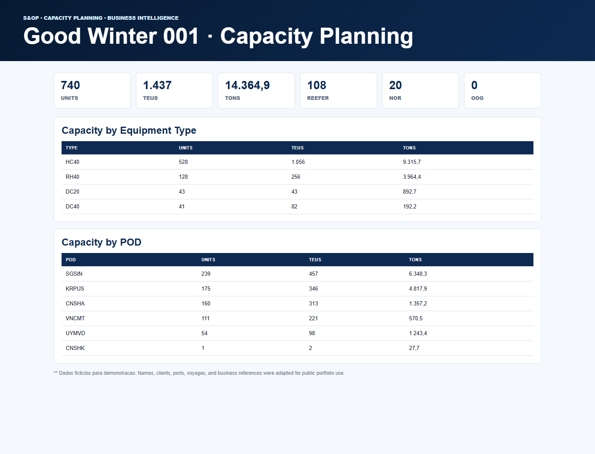
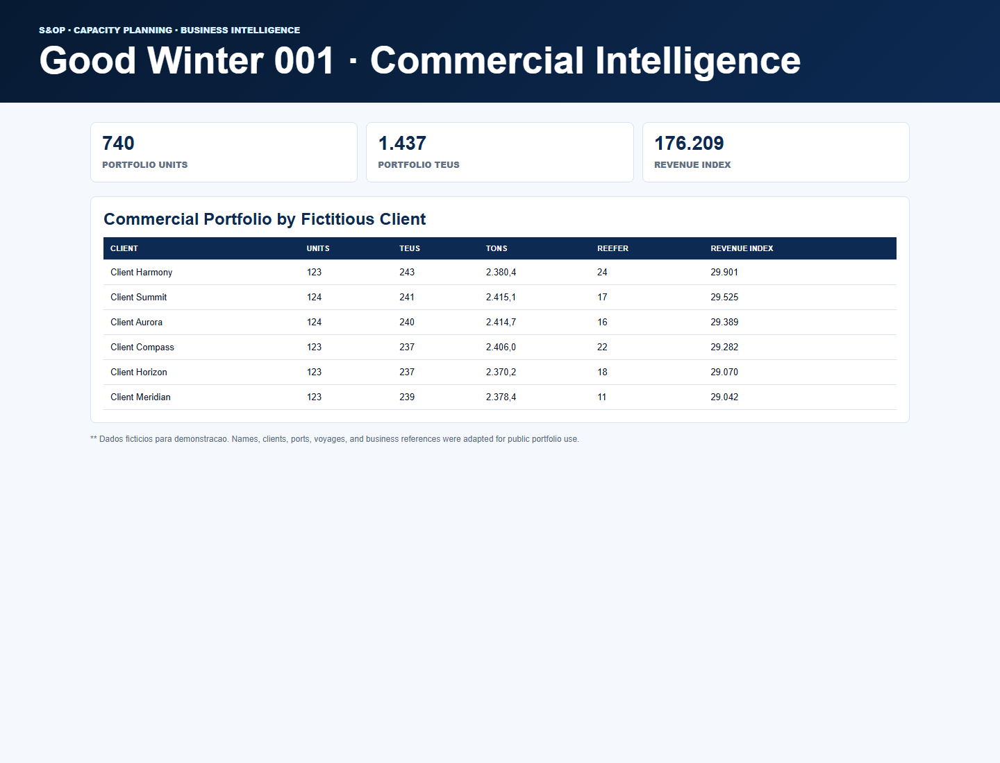
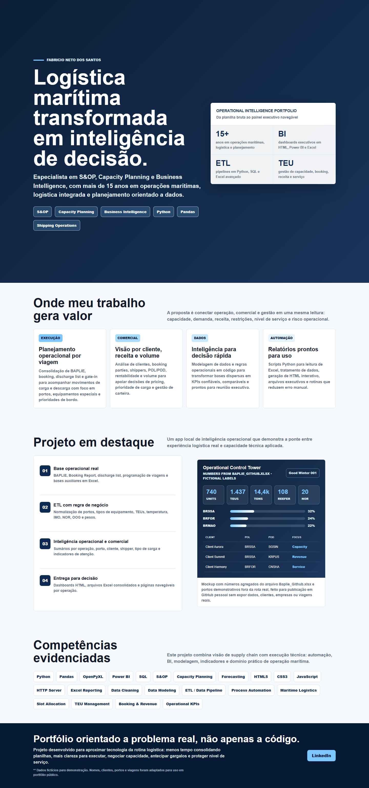

# S&OP Capacity Planning BI

Portfolio project focused on **S&OP, capacity planning, maritime logistics, business intelligence, and Python process automation**.



This project demonstrates how a BAPLIE-style Excel file can be transformed into executive-ready intelligence: capacity KPIs, gate-in visibility, commercial views, plan-versus-actual dashboards, and HTML reports.

Demo vessel: **Good Winter 001**

** Dados ficticios para demonstracao. Names, clients, ports, voyages, and business references were adapted for public portfolio use.

## Visual Preview

### Capacity Planning Report


### Commercial Intelligence Report



### Portfolio Cover



## Open The Reports

| Report | Link |
| --- | --- |
| Portfolio cover | [index.html](index.html) |
| Capacity planning | [reports/good_winter_capacity_planning.html](reports/good_winter_capacity_planning.html) |
| Gate-in execution | [reports/good_winter_gate_in_report.html](reports/good_winter_gate_in_report.html) |
| Commercial intelligence | [reports/good_winter_commercial_intelligence.html](reports/good_winter_commercial_intelligence.html) |
| Planning comparison | [reports/good_winter_comparison_dashboard.html](reports/good_winter_comparison_dashboard.html) |
| Final moves | [reports/good_winter_final_moves.html](reports/good_winter_final_moves.html) |
| All-ports movements | [reports/good_winter_moves_all_ports.html](reports/good_winter_moves_all_ports.html) |

## Why This Project Matters

Logistics teams often work with fragmented spreadsheets, manual checks, and urgent operational questions:

- How much capacity is planned versus loaded?
- Which ports and cargo types are driving volume?
- Where are reefer, NOR, OOG, and weight risks concentrated?
- How can commercial, planning, and execution teams read the same numbers?

This project turns that workflow into a structured analytical pipeline using Python, Excel automation, and HTML dashboards.

## Professional Focus

- **S&OP and Capacity Planning**: TEU, weight, port, equipment, reefer, NOR, IMO, and OOG visibility.
- **Business Intelligence**: executive KPIs, dashboard-ready outputs, and summarized views.
- **Commercial Intelligence**: fictitious client segmentation, volume concentration, and revenue-index logic.
- **Operational Execution**: gate-in, BAPLIE, loaded cargo, plan-versus-actual comparison, and exception tracking.
- **Automation**: repeatable Python scripts that reduce manual spreadsheet consolidation.

## Code Example

The shared BAPLIE parser normalizes raw Excel rows into a clean analytical dataset used by all reports:

```python
def load_baplie(path: Path = DATA_FILE) -> pd.DataFrame:
    header = find_header_row(path)
    df = pd.read_excel(path, header=header).dropna(how="all").copy()
    df = df[df.get("Container Id", "").apply(has_value)].copy()

    rows = []
    for idx, row in df.reset_index(drop=True).iterrows():
        norm_type = normalize_type(
            row.get("Type", ""),
            row.get("Size", ""),
            row.get("Height", ""),
            row.get("Setting", ""),
        )
        weight_kg = pd.to_numeric(row.get("Weight", 0), errors="coerce")
        weight_kg = 0 if pd.isna(weight_kg) else float(weight_kg)
        rows.append({
            "Vessel": VESSEL_NAME,
            "Container": f"DEMO{idx + 1:06d}",
            "POL": str(row.get("POL", "")).upper(),
            "POD": str(row.get("POD", "")).upper(),
            "Type": norm_type,
        })
```

Full source: [src/good_winter_baplie_tools.py](src/good_winter_baplie_tools.py)

## Repository Structure

```text
.
├── README.md
├── index.html
├── requirements.txt
├── data/
│   └── Baplie_Github.xlsx
├── docs/
│   ├── GitHub_Capa_Logistica_Automacao.html
│   └── screenshots/
├── reports/
│   ├── good_winter_capacity_planning.html
│   ├── good_winter_commercial_intelligence.html
│   ├── good_winter_comparison_dashboard.html
│   ├── good_winter_final_moves.html
│   ├── good_winter_gate_in_report.html
│   └── good_winter_moves_all_ports.html
└── src/
    ├── good_winter_baplie_tools.py
    ├── good_winter_capacity_planning.py
    ├── good_winter_commercial_intelligence.py
    ├── good_winter_comparison_dashboard.py
    ├── good_winter_final_moves.py
    ├── good_winter_gate_in_report.py
    └── good_winter_moves_all_ports.py
```

## Main Scripts

| Script | Purpose |
| --- | --- |
| [good_winter_baplie_tools.py](src/good_winter_baplie_tools.py) | Shared parser, KPI logic, type normalization, and HTML writer. |
| [good_winter_capacity_planning.py](src/good_winter_capacity_planning.py) | Builds capacity indicators by units, TEUs, tons, equipment type, reefer, NOR, IMO, and OOG. |
| [good_winter_gate_in_report.py](src/good_winter_gate_in_report.py) | Creates a gate-in/load execution report from the BAPLIE demo file. |
| [good_winter_commercial_intelligence.py](src/good_winter_commercial_intelligence.py) | Produces a fictitious commercial view by client, port, volume, and revenue-like index. |
| [good_winter_comparison_dashboard.py](src/good_winter_comparison_dashboard.py) | Compares plan-style capacity targets versus loaded BAPLIE figures. |
| [good_winter_final_moves.py](src/good_winter_final_moves.py) | Generates an executive final-moves summary for planning and execution teams. |
| [good_winter_moves_all_ports.py](src/good_winter_moves_all_ports.py) | Exports detailed movements by port and equipment type. |

## How To Run

Install dependencies:

```bash
pip install -r requirements.txt
```

Run any report script:

```bash
python src/good_winter_capacity_planning.py
python src/good_winter_gate_in_report.py
python src/good_winter_commercial_intelligence.py
python src/good_winter_comparison_dashboard.py
python src/good_winter_final_moves.py
python src/good_winter_moves_all_ports.py
```

Outputs are written to:

```text
reports/
```
