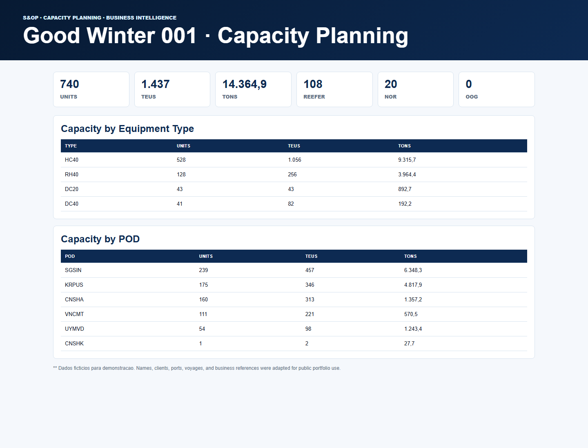
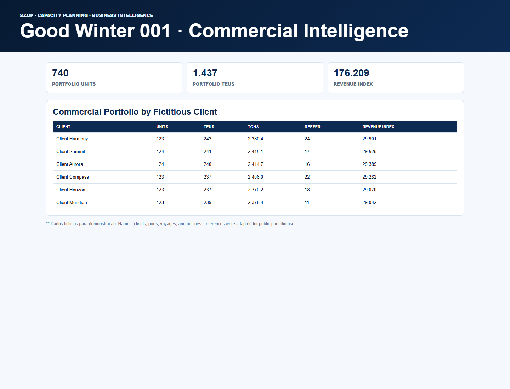
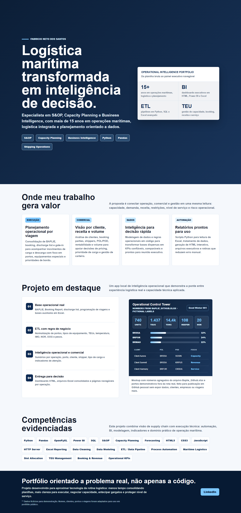

# Capacity Shortfall Intelligence

Python and BI portfolio case for maritime capacity planning, shortfall analysis, and vessel execution visibility.

This is the dedicated technical case behind the main portfolio. It shows how a BAPLIE-style Excel file becomes operational intelligence: capacity KPIs, gate-in visibility, commercial views, plan-versus-actual dashboards, final moves, and HTML reports.



## Decision Value

This project prevented capacity planning errors before vessel execution by identifying shortfall at port level.

The operational question:

> Is the vessel plan feasible by TEU, weight, equipment, port, reefer, NOR, IMO, OOG, and execution window?

The answer is produced through repeatable Python processing and dashboard-ready reports, instead of manual spreadsheet consolidation.

## Impact

- Reduced vessel planning cycle time from 4h to 20 min per vessel/day.
- Processed 950+ container moves in under 20 minutes.
- Identified shortfall risk before execution, including 99+ TEUs at port level.
- Created shared visibility for planning, commercial, and execution teams.

Demo vessel: **Good Winter 001**

Public data is sanitized for demonstration. Names, clients, ports, voyages, and business references were adapted for portfolio use.

## Open The Reports

| Report | Link | Decision Supported |
| --- | --- | --- |
| Portfolio cover | [index.html](index.html) | Fast project entry point. |
| Capacity planning | [reports/good_winter_capacity_planning.html](reports/good_winter_capacity_planning.html) | Vessel feasibility by unit, TEU, weight, port, and equipment. |
| Gate-in execution | [reports/good_winter_gate_in_report.html](reports/good_winter_gate_in_report.html) | Cargo readiness and execution visibility. |
| Commercial intelligence | [reports/good_winter_commercial_intelligence.html](reports/good_winter_commercial_intelligence.html) | Demand concentration by client and port. |
| Planning comparison | [reports/good_winter_comparison_dashboard.html](reports/good_winter_comparison_dashboard.html) | Plan versus loaded cargo and exception areas. |
| Final moves | [reports/good_winter_final_moves.html](reports/good_winter_final_moves.html) | Last operational changes before execution. |
| All-ports movements | [reports/good_winter_moves_all_ports.html](reports/good_winter_moves_all_ports.html) | Detailed movement visibility by port and equipment. |

## Visual Preview

### Capacity Planning Report


### Commercial Intelligence Report



### Portfolio Cover



## What The System Does

- Reads BAPLIE-style Excel data.
- Normalizes container, port, equipment, weight, and cargo attributes.
- Classifies equipment and operational flags.
- Calculates capacity indicators by unit, TEU, ton, port, equipment, reefer, NOR, IMO, and OOG.
- Produces HTML reports for fast review.
- Creates a repeatable workflow that can be rerun when the operation changes.

## Why It Matters

Manual capacity review is slow and fragile when booking demand, vessel plan, gate-in status, and final moves live in different files.

This project turns that workflow into a decision system:

- shortfall appears earlier;
- risk is visible at port level;
- planning and execution use the same numbers;
- dashboards explain what changed and where action is needed.

## Code Example

The shared BAPLIE parser normalizes raw Excel rows into a clean analytical dataset used by all reports:

```python
def load_baplie(path: Path = DATA_FILE) -> pd.DataFrame:
    header = find_header_row(path)
    df = pd.read_excel(path, header=header).dropna(how="all").copy()
    df = df[df.get("Container Id", "").apply(has_value)].copy()

    rows = []
    for idx, row in df.reset_index(drop=True).iterrows():
        norm_type = normalize_type(
            row.get("Type", ""),
            row.get("Size", ""),
            row.get("Height", ""),
            row.get("Setting", ""),
        )
        weight_kg = pd.to_numeric(row.get("Weight", 0), errors="coerce")
        weight_kg = 0 if pd.isna(weight_kg) else float(weight_kg)
        rows.append({
            "Vessel": VESSEL_NAME,
            "Container": f"DEMO{idx + 1:06d}",
            "POL": str(row.get("POL", "")).upper(),
            "POD": str(row.get("POD", "")).upper(),
            "Type": norm_type,
        })
```

Full source: [src/good_winter_baplie_tools.py](src/good_winter_baplie_tools.py)

## Repository Structure

```text
.
|-- README.md
|-- index.html
|-- requirements.txt
|-- data/
|   `-- Baplie_Github.xlsx
|-- docs/
|   |-- GitHub_Capa_Logistica_Automacao.html
|   `-- screenshots/
|-- reports/
|   |-- good_winter_capacity_planning.html
|   |-- good_winter_commercial_intelligence.html
|   |-- good_winter_comparison_dashboard.html
|   |-- good_winter_final_moves.html
|   |-- good_winter_gate_in_report.html
|   `-- good_winter_moves_all_ports.html
`-- src/
    |-- good_winter_baplie_tools.py
    |-- good_winter_capacity_planning.py
    |-- good_winter_commercial_intelligence.py
    |-- good_winter_comparison_dashboard.py
    |-- good_winter_final_moves.py
    |-- good_winter_gate_in_report.py
    `-- good_winter_moves_all_ports.py
```

## How To Run

Install dependencies:

```bash
pip install -r requirements.txt
```

Run any report script:

```bash
python src/good_winter_capacity_planning.py
python src/good_winter_gate_in_report.py
python src/good_winter_commercial_intelligence.py
python src/good_winter_comparison_dashboard.py
python src/good_winter_final_moves.py
python src/good_winter_moves_all_ports.py
```
